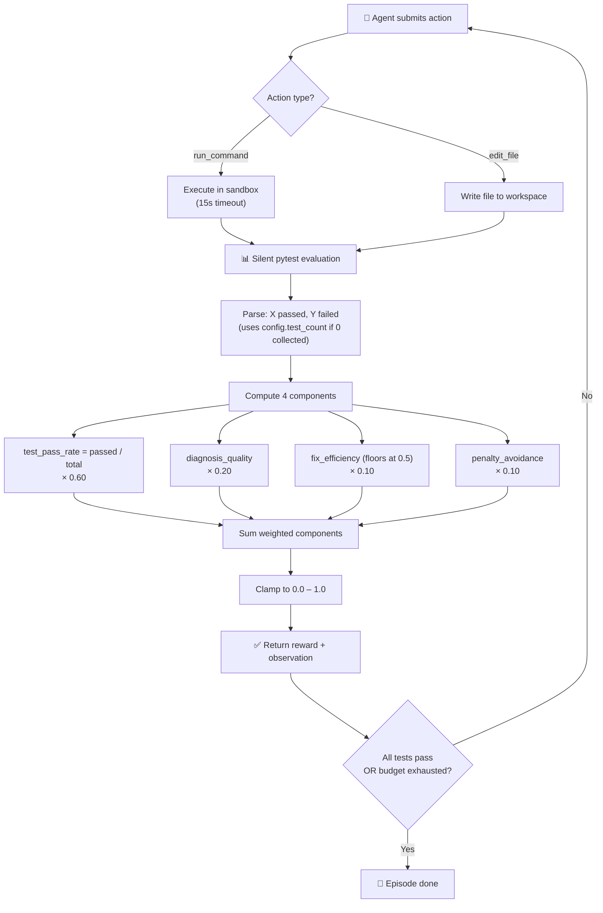

# gREV 

> An **OpenEnv-compliant** RL environment where AI agents are dropped into broken Python repositories and must diagnose and fix them — using real shell commands and file edits — until the full `pytest` suite passes.

[](https://github.com/openenv)
[](https://langersword-grev-openenv.hf.space)
[](LICENSE)
[](https://python.org)
[](https://fastapi.tiangolo.com)

**Live endpoint:** `https://langersword-grev-openenv.hf.space`
**Hackathon:** Scaler × Meta / Hugging Face OpenEnv Challenge — April 2026

---

## Table of Contents

- [Overview](#overview)
- [Why This Domain](#why-this-domain)
- [Architecture](#architecture)
- [Documentation](#documentation)
  - [Observation Space](#observation-space)
  - [Action Space](#action-space)
  - [Reward Function](#reward-function)
- [Tasks](#tasks)
- [Setup](#setup)
- [Running the Baseline Agent](#running-the-baseline-agent)
- [API Reference](#api-reference)
- [Validation](#validation)

---

## Overview

Every software engineer knows the experience: CI goes red, `pytest` is failing, and you need to find and fix the bug before the next deploy. gREV turns this into a structured training environment for AI agents.

The agent is given a **broken Python repository** with one or more bugs. It has access to a sandboxed shell — it can run `pytest`, `cat` files, `grep` for patterns — and it can overwrite files with corrected content. The episode ends when all tests pass (reward → 1.0) or the step budget runs out (fractional credit based on progress).

Grading is **fully deterministic** — scores are computed by parsing `pytest` output and tracking agent behaviour, never by an LLM judge. Same repo, same seed, same actions → same score.

---

## Why This Domain

Software debugging is one of the most time-intensive tasks developers face.

**The task is genuinely hard for AI.** Reading a `pytest` traceback, identifying which file caused the failure, understanding whether it is a syntax error, logic error, or import mismatch — and then writing a correct fix — requires multi-step reasoning that current models still find challenging.

**The grader is perfectly deterministic.** `pytest` output is structured: `N passed, M failed`. No subjectivity. The multi-component reward system provides rich training signal across diagnosis, fixing, and efficiency dimensions.

**The difficulty ladder is natural.** Syntax errors are visually obvious. Logic errors require reading both the test's expectation and the source. Multi-file import mismatches require tracing dependencies across files. Each tier demands deeper reasoning.

---

## Architecture

```
gREV/
├── openenv.yaml              # OpenEnv manifest (spec_version: 1)
├── inference.py              # Baseline agent — direct env import, argparse
├── Dockerfile                # python:3.11-slim → HF Spaces port 7860
├── pyproject.toml            # Dependencies and package config
│
├── grev/
│   ├── __init__.py
│   ├── models.py             # Pydantic v2: GrevAction, GrevObservation, GrevState
│   │                         #   extends OpenEnv Action/Observation/State
│   └── env.py                # Core engine — RepairGrader, subprocess sandbox
│
├── server/
│   └── app.py                # FastAPI via openenv create_app()
│
└── tasks/
    ├── easy/                 # calculator.py — syntax + logic error (8 tests)
    ├── medium/               # data_processor.py — 3 logic bugs (14 tests)
    └── hard/                 # auth.py + models.py — 4 cross-file bugs (15 tests)
```

### Core Engine (`grev/env.py`)

Implements the OpenEnv `Environment` interface with a `RepairGrader` that scores every step across 4 weighted components. State isolation is enforced by wiping `/tmp/grev_workspace` with `shutil.rmtree()` on each `reset()`. All commands run with a strict 15-second `subprocess` timeout.

### Server (`server/app.py`)

Uses `openenv.core.env_server.http_server.create_app()` to expose the standard OpenEnv HTTP endpoints: `/reset`, `/step`, `/state`, `/health`.

### Inference (`inference.py`)

Imports the environment **directly** (no HTTP). Uses the OpenAI Python client against the free HuggingFace Inference Router. Falls back to a deterministic rule-based policy when no API key is set.

---

## Documentation

### Observation Space

Returned as a `GrevObservation` after every `reset()` and `step()` call.

| Field | Type | Description |
|-------|------|-------------|
| `done` | `bool` | `true` when all tests pass or step budget is exhausted |
| `reward` | `float` | Composite reward for this step (0.0–1.0) |
| `current_directory` | `str` | Absolute path to the agent's writable workspace |
| `directory_contents` | `list[str]` | All files present in the workspace root |
| `last_command_stdout` | `str` | Full stdout from the previous action |
| `last_command_stderr` | `str` | Full stderr from the previous action |
| `last_error` | `str \| null` | Error message if the last action was invalid |

### Action Space

The agent sends a `GrevAction` object. Two action types are supported.

#### `run_command`
Execute any shell command inside the sandboxed workspace.
```json
{
  "action_type": "run_command",
  "command": "pytest -v"
}
```
Runs from `current_directory` with a 15-second hard timeout. The agent can use: `pytest`, `cat`, `python -c`, `grep`, `ls`, `head`, etc.

#### `edit_file`
Overwrite a workspace file with corrected content.
```json
{
  "action_type": "edit_file",
  "file_path": "calculator.py",
  "new_content": "def multiply(a, b):\n    return a * b\n"
}
```

### Reward Function

gREV uses a **4-component weighted reward** computed after every step, providing rich intermediate training signal:

| Component | Weight | What It Measures |
|-----------|--------|-----------------|
| `test_pass_rate` | **0.60** | Fraction of pytest tests currently passing |
| `diagnosis_quality` | **0.20** | Did the agent run pytest and read files before editing? |
| `fix_efficiency` | **0.10** | Fewer steps used = higher score (floors at 0.5) |
| `penalty_avoidance` | **0.10** | No timeouts or invalid actions = full score |

#### How Grading Works (Step-by-Step)



**Penalty table:**

| Event | Adjustment |
|-------|-----------|
| Command timed out (15s) | `-0.10` penalty |
| Invalid action (missing fields) | `-0.05` penalty |

All rewards are clamped to `[0.0, 1.0]`.

---

## Tasks

5 tasks across a difficulty ladder — each adds a new class of bug that requires deeper reasoning:

### `easy` — Syntax + Logic Fix
**Files:** `calculator.py` (2 bugs), `test_calculator.py` (8 tests)
**Bugs:** Missing colon on `multiply` function def + wrong operator (`+` instead of `*`)
**Partial credit:** Fixing just the syntax error lets 6/8 tests pass. Fixing both → 1.0.

### `medium` — Multi-Bug Data Pipeline
**Files:** `data_processor.py` (3 bugs), `test_data_processor.py` (14 tests)
**Bugs:** Wrong CSV delimiter (`;` → `,`), off-by-one in `calculate_average`, inverted comparison in `filter_above_threshold`
**Partial credit:** Each bug fix unlocks a cluster of tests. Smooth reward curve.

### `hard` — Cross-File Import & Logic
**Files:** `auth.py` (4 bugs) + `models.py`, `test_auth.py` (15 tests)
**Bugs:** 2 import mismatches, inverted permission check, wrong dict key
**Partial credit:** Import fixes unlock auth tests, logic fix unlocks permission tests.

### `medium_hard` — Decorator, Generator & Mutation Bugs
**Files:** `pipeline.py` (3 bugs), `test_pipeline.py` (16 tests)
**Bugs:** `retry` decorator swallows `return` value; `chunked_reader` generator skips the last partial chunk (`i + chunk_size <= len` instead of `i < len`); `normalize_record` mutates its input dict instead of a copy
**What makes it hard:** Each bug is a subtle Python pattern (closures, generators, mutability) that looks correct on first read.

### `very_hard` — Abstract Storage Class Hierarchy
**Files:** `storage.py` (4 bugs across ABC + 3 concrete classes), `test_storage.py` (27 tests)
**Bugs:** `MemoryStorage` missing `exists()` override; `FileStorage.read()` opens in binary mode (`"rb"`) returning `bytes` not `str`; `CachingStorage.write()` doesn't update cache (stale reads); `BaseStorage.copy()` has wrong argument order
**What makes it hard:** The bugs span an inheritance chain — each concrete class has a different failure pattern, and `copy()` only breaks when all 3 stores work in isolation.

| Level | Bugs | Tests | Max Steps |
|-------|------|-------|-----------|
| easy | 2 | 8 | 12 |
| medium | 3 | 14 | 16 |
| hard | 4 | 15 | 20 |
| medium_hard | 3 | 16 | 18 |
| very_hard | 4 | 27 | 24 |

---

## Baseline Scores

Run with deterministic fallback agent (no LLM — `pytest` then `cat`, seed 42):

| Task | Fallback score | Expected with LLM |
|------|---------------|-------------------|
| easy | 0.23 | ~0.75–1.0 |
| medium | 0.37 | ~0.60–0.90 |
| hard | 0.27 | ~0.40–0.70 |
| medium_hard | 0.44 | ~0.50–0.80 |
| very_hard | 0.35 | ~0.30–0.60 |

Fallback scores represent the diagnostic signal only (ran pytest + read main file). A strong LLM agent should score significantly higher by actually applying fixes.

Reproduce:
```bash
python inference.py --task all --episodes 1 --seed 42
```

---

## Setup

### Local Development

```bash
git clone https://github.com/LangerSword/gREV
cd gREV

# with uv (recommended)
uv sync

# run inference locally (works without API key — uses deterministic fallback)
python inference.py --task all --episodes 1 --seed 42

# or with the venv
uv run python inference.py --task all
```

### Docker

```bash
docker build -t grev-env .
docker run -p 7860:7860 grev-env
```

### Environment Variables

| Variable | Default | Description |
|----------|---------|-------------|
| `HF_TOKEN` | — | HuggingFace token (free — used as API key for LLM) |
| `API_BASE_URL` | `https://router.huggingface.co/v1` | LLM API endpoint |
| `MODEL_NAME` | `Qwen/Qwen2.5-72B-Instruct` | Model for inference |

---

## Running the Baseline Agent

The inference script uses the free HuggingFace Inference Router. No paid API keys required.

```bash
# Without API key — deterministic fallback (pytest → cat → stop)
python inference.py --task all --episodes 1 --seed 42

# With HF token — LLM-driven agent
export HF_TOKEN=hf_your_token_here
python inference.py --task all --episodes 1 --seed 42
```

**CLI arguments:**

| Flag | Values | Default | Description |
|------|--------|---------|-------------|
| `--task` | `easy`, `medium`, `hard`, `all` | `all` | Which task(s) to run |
| `--episodes` | `int` | `1` | Episodes per task |
| `--seed` | `int` | `42` | Random seed |

**Expected output:**
```
[START] task=easy env=grev model=Qwen/Qwen2.5-72B-Instruct ...
[STEP] step=1 action=pytest reward=0.21 done=false error=null
[STEP] step=2 action=cat calculator.py reward=0.27 done=false error=null
[END] success=false steps=2 score=0.270 rewards=0.21,0.27
[SUMMARY] episodes=3 avg_score=0.376
```

---

## API Reference

### `GET /health`
Liveness check. Returns `{"status": "healthy"}`.

### `POST /reset`
Start a new episode. Wipes workspace, copies fresh broken repo.
```json
{"task_level": "easy", "seed": 42}
```

### `POST /step`
Execute one action, returns `GrevObservation` with reward and done flag.

### `GET /state`
Returns full `GrevState`: `task_level`, `step_count`, `workspace_dir`, `max_steps`, `directory_contents`.

---

## Validation

```bash
pip install openenv-core
openenv validate
```

Or use the bundled validation script:
```bash
./scripts/validate-submission.sh https://langersword-grev-openenv.hf.space
```

---

## License

MIT — see [LICENSE](LICENSE)

---

*Built for the Scaler × Meta / Hugging Face OpenEnv Hackathon, April 2026.*
